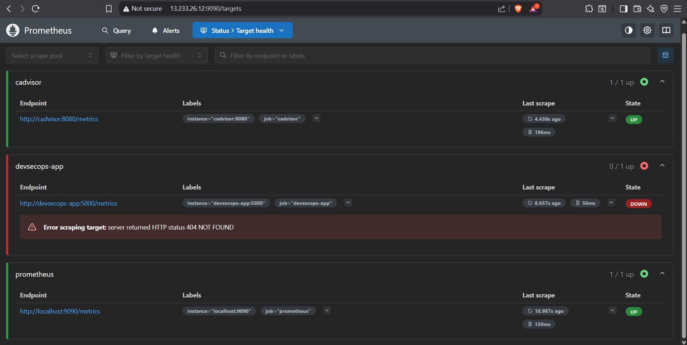
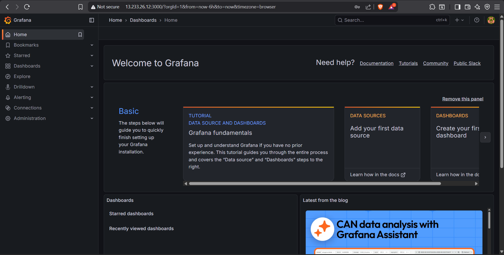
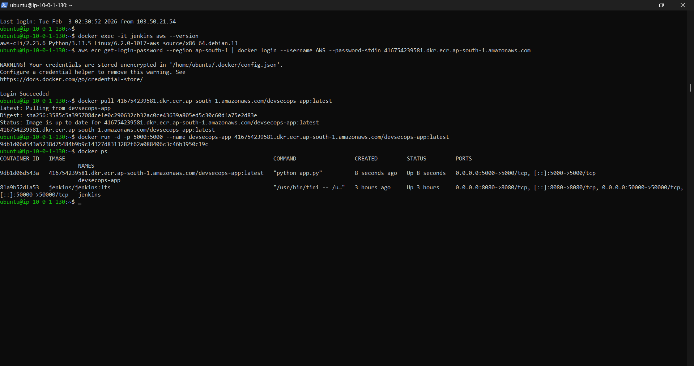

# DevSecOps Pipeline Project

## Tech Stack
- Jenkins
- Docker
- AWS ECR
- Python Flask App
- Prometheus
- Grafana
- cAdvisor

## Pipeline Flow
1. Jenkins pulls code from GitHub
2. Builds Docker image
3. Pushes image to AWS ECR
4. Deploys container on EC2
5. Monitoring via Prometheus + Grafana

## Screenshots

### Jenkins Pipeline

### AWS ECR

### Application Running

### Prometheus

### Grafana

### Docker Containers

